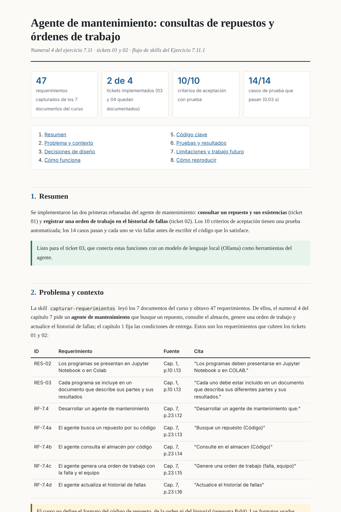

# 7. Inteligencia Artificial Generativa

Desarrollo de los ejercicios propuestos en la sección 7.11 del capítulo
*Inteligencia Artificial Generativa* (José J. Martínez P.), curso de Inteligencia Artificial y Minirobots.

Los programas se entregan como notebooks de Jupyter, ejecutados y con sus resultados incluidos. El documento [`Documento_IA_Generativa.pdf`](Documento_IA_Generativa.pdf) describe las partes y los resultados de cada programa, el uso de herramientas de IA generativa, y contiene los enlaces para abrir cada notebook en Google Colab.

## Ejercicios desarrollados

| Ejercicio | Notebook | Herramienta | Verificación | Resultado principal |
|---|---|---|---|---|
| 1. Skills propias a partir de las de [AI Hero](https://www.aihero.dev/) | [Ejercicio 1](notebooks/Ejercicio_1_Definicion_de_Skills.ipynb) | Formato *Agent Skills* (`SKILL.md` + plantillas + scripts en Python), pytest | Validación del formato de las 4 skills; prueba de activación de las descripciones (8/8); detección medida contra una referencia escrita a mano (45/45); flujo completo sobre los 7 documentos de la clase | De los 7 capítulos del curso salen 47 requerimientos, el estado de cada capítulo en el repositorio, 4 tickets, 10 criterios con prueba (14/14 casos, ciclo rojo-verde registrado) y un informe HTML |
| 2. Chatbot para consultar manuales técnicos | [Ejercicio 2](notebooks/Ejercicio_2_Chatbot.ipynb) | RAG con Ollama + embeddings locales (`nomic-embed-text`, `llama3.2:3b`), Python, `requests`, PyMuPDF | Preparación del entorno con Ollama; carga desde Hugging Face o PDF; división, indexación y recuperación semántica; prueba de respuesta con fuentes | Chatbot que responde preguntas sobre manuales técnicos usando recuperación por similitud y muestra las fuentes consultadas |
| 3. Chatbot con documentos de clase | [Ejercicio 3](notebooks/Ejercicio_3_Chatbot_con_documentos_de_clase.ipynb) | RAG con Ollama + embeddings locales (`bge-m3`, `llama3.2:3b`), Python, PyMuPDF | Carga de los PDFs de clase, división en fragmentos, indexación semántica, consultas con recuperación por similitud y citación de fuentes | Chatbot que responde preguntas sobre los materiales del curso usando contexto recuperado de los documentos y referencias a páginas concretas |

## Las cuatro skills

| Numeral | Skill | Basada en (AI Hero) | Entrada → salida | Scripts |
|---|---|---|---|---|
| 4 | [`capturar-requerimientos`](skills/capturar-requerimientos/SKILL.md) | `/grill-with-docs`, `/to-spec` | PDF, DOCX, TXT o MD → `requerimientos.md` trazable (ejercicios, reglas de selección, condiciones, preguntas abiertas) | `extraer_texto.py`, `detectar_requerimientos.py` |
| 1 | [`documentar-ticket`](skills/documentar-ticket/SKILL.md) | `/to-tickets`, `/to-spec` | Requerimientos → `tickets/NN-*.md` con criterios *Dado/Cuando/Entonces* | `validar_ticket.py` |
| 2 | [`implementar-con-pruebas`](skills/implementar-con-pruebas/SKILL.md) | `/implement`, `/tdd`, `/code-review` | Ticket → código + pruebas, bitácora rojo-verde y trazabilidad | `ciclo.py`, `trazabilidad.py` |
| 3 | [`explicar-en-html`](skills/explicar-en-html/SKILL.md) | `/teach` | Evidencia del trabajo → `explicacion.html` autocontenido | `generar_html.py` |



## Estructura

```
7. IA Generativa/
├── README.md
├── requirements.txt
├── Documento_IA_Generativa.pdf
├── notebooks/
│   ├── Ejercicio_1_Definicion_de_Skills.ipynb
│   ├── Ejercicio_2_Chatbot.ipynb
│   └── Ejercicio_3_Chatbot_con_documentos_de_clase.ipynb
├── documentos_clase/         los 7 PDF de la clase, entrada de la demostración
├── skills/                   las 4 skills (las escribe el notebook)
├── demo/                     salida del flujo completo (sección 10 del notebook)
│   ├── texto/  candidatos/   texto extraído y candidatos de cada documento
│   ├── salida/               requerimientos.md, contenido.json, explicacion.html
│   ├── proyecto/             tickets, código, pruebas y bitácora TDD
│   └── dist/                 cada skill en .zip para cargarla en Claude
└── img/
```

## Ejecución

### Google Colab

Ingresar a colab.research.google.com y abrir el notebook mediante *Archivo → Abrir notebook → GitHub*,
indicando la dirección del repositorio, o usar directamente el enlace del documento. Ejecutar con
*Entorno de ejecución → Ejecutar todas*. pandas, scikit-learn y pytest vienen preinstalados y `pypdf`
se instala automáticamente; las carpetas `skills/` y `demo/` se crean en el directorio de trabajo. Si la
carpeta `documentos_clase/` no está, el notebook pide subir los 7 PDF de la clase.

### Jupyter local

```bash
pip install -r requirements.txt
jupyter notebook notebooks/
```

El notebook tarda unos 15 s.

### Uso de las skills en un agente

- **Claude Code:** copiar las carpetas de `skills/` a `~/.claude/skills/` (o a `.claude/skills/` del proyecto). Se activan solas por la descripción o con `/capturar-requerimientos`, `/documentar-ticket`, etc.
- **Claude (web o escritorio):** subir los `.zip` de `demo/dist/` en Configuración → Capacidades → Skills.

## Referencias

- Martínez, J. J. (2026). *Inteligencia Artificial Generativa*, capítulo 7. Material del curso.
- Pocock, M. (2026). *AI Hero: Skills*. https://www.aihero.dev/ · https://github.com/mattpocock/skills (MIT).
- Anthropic (2025). *Agent Skills*. https://docs.claude.com/en/docs/agents-and-tools/agent-skills/overview
- Beck, K. (2002). *Test-Driven Development: By Example*. Addison-Wesley.
